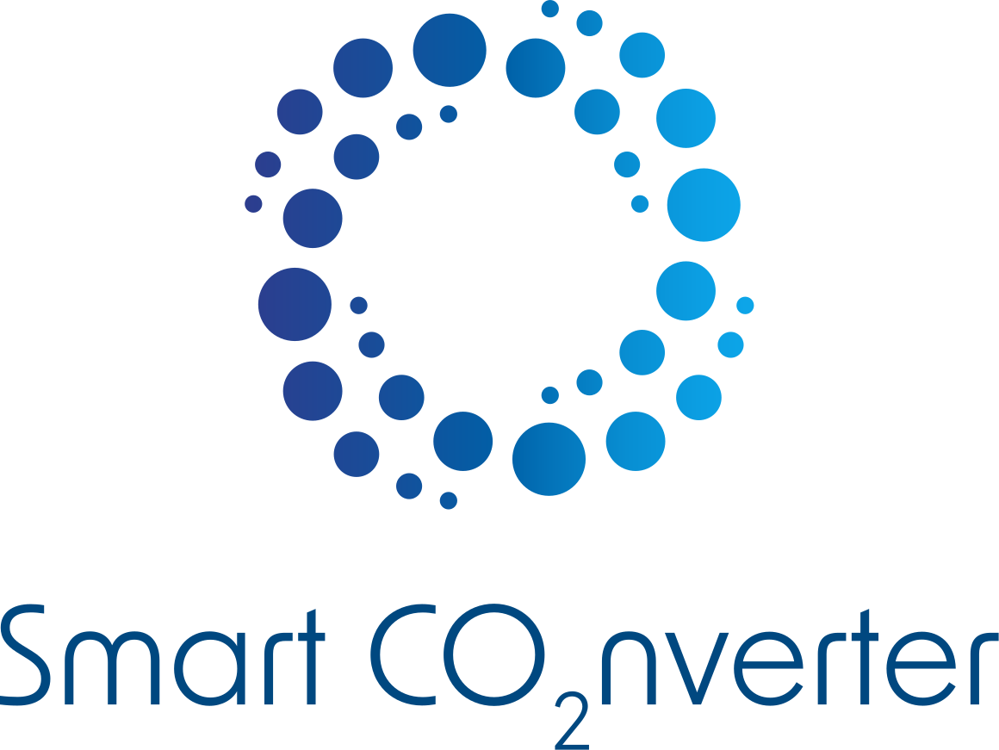
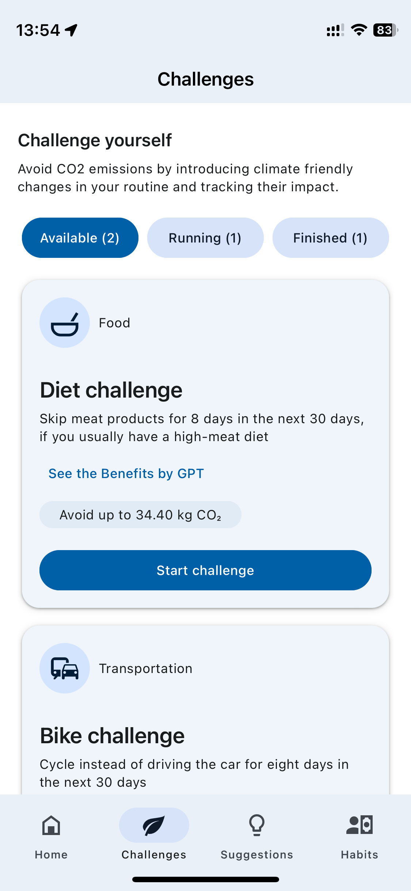
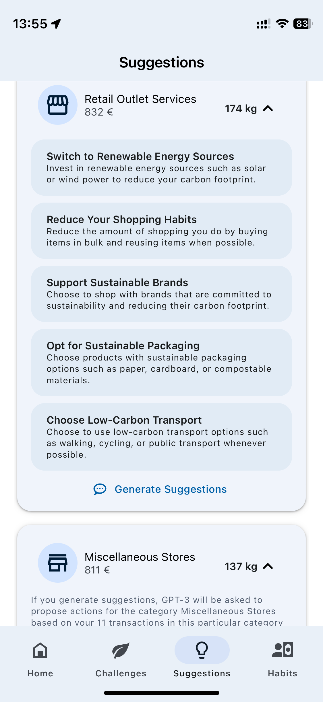
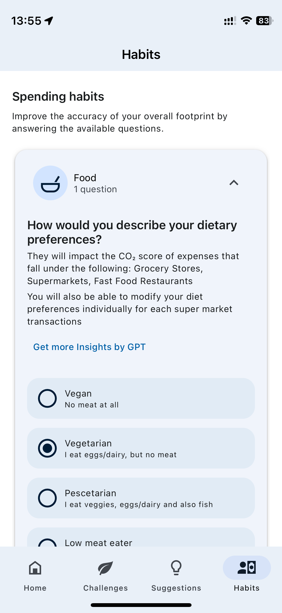

# CPADTeam02 🏃🧘‍♂️

BITS ID     | Name          | GitHub ID
----------  | -----         | --------
2021hs70014 | Navya Khurana | navyakhurana
2021hs70005 | Kartik Kapoor | kartikapoor12
2021hs70013 | Ayush Behl    | ayushbehl
2021hs70038 | Sudhit Jain   | DevSudhit

# Reduce your CO2 footprint using a smart Generative AI application on SAP BTP

 

  

In today's world, there is a growing need for individuals to adopt more sustainable behaviors to combat climate change. The challenge is to provide consumers with the tools and insights necessary to understand and reduce their carbon footprint. How might we enable consumers to be more climate conscious while encouraging them to make impactful changes in their daily lives?

The Smart CO2 Converter is an innovative mobile application designed to empower consumers to understand and reduce their carbon footprint. Built using SAP Cloud Application Programming (CAP) model and React Native on SAP Business Technology Platform (BTP), the app leverages Generative AI via Azure Open AI to provide personalized insights and actionable recommendations. By analyzing users' daily activities and highlighting the most impactful habits, the Smart CO2 Converter guides users towards more sustainable choices, fostering environmental responsibility and promoting a greener lifestyle.

     

### Current Position - What is the challenge?
How might we enable people to be more climate conscious while strengthening their loyalty?

### Destination - What is the outcome?
Help users understand how their consumption habits are driving their CO2 footprint by showing the most impactful expenses and best opportunities for emissions reductions.

### How You Get There - What is the solution?
A mobile app built using the reusable architecture principles of SAP Cloud Application Programming (CAP) model and React Native on SAP BTP. An application extension using GPT via the Azure Open AI service that combines business context with the capabilities of large language models on SAP BTP.

## Outcome

A mobile app built using the reusable architecture principles of SAP Cloud Application Programming (CAP) model and React Native on SAP BTP. An application extension using GPT via the Azure Open AI service that combines business context with the capabilities of large language models on SAP BTP.

  
  
  
  

## Documents
### Stakeholder Document - [Here](documentation/Stakeholder.md)
### User requirements document (URD) Document - [Here](documentation/URD.md)
### Software Requirements Specification (SRS) Document  - [Here](documentation/SoftwareRequirementSpecification.md)
### Architecture Document- [Here](documentation/architecture.md)
### Software Design Document- [Here](documentation/softwareDesign.md)
### App Testing Document- [Here](documentation/testing.md)