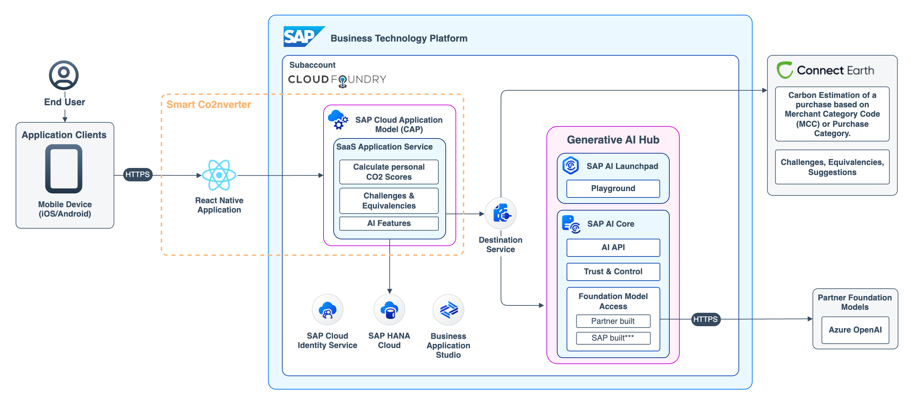
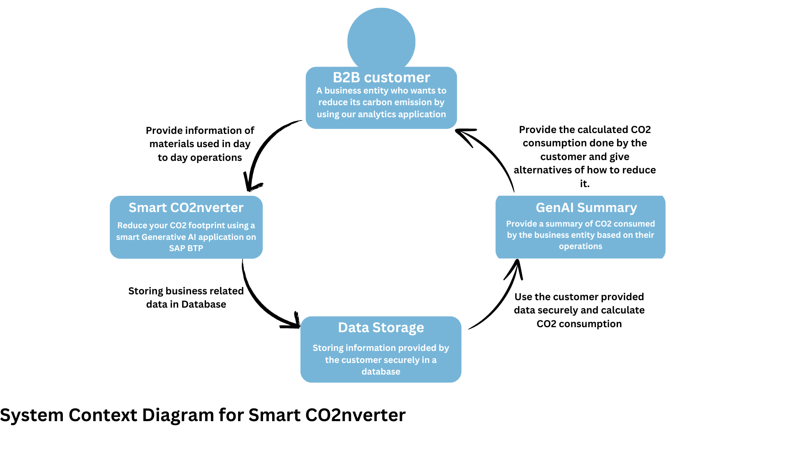
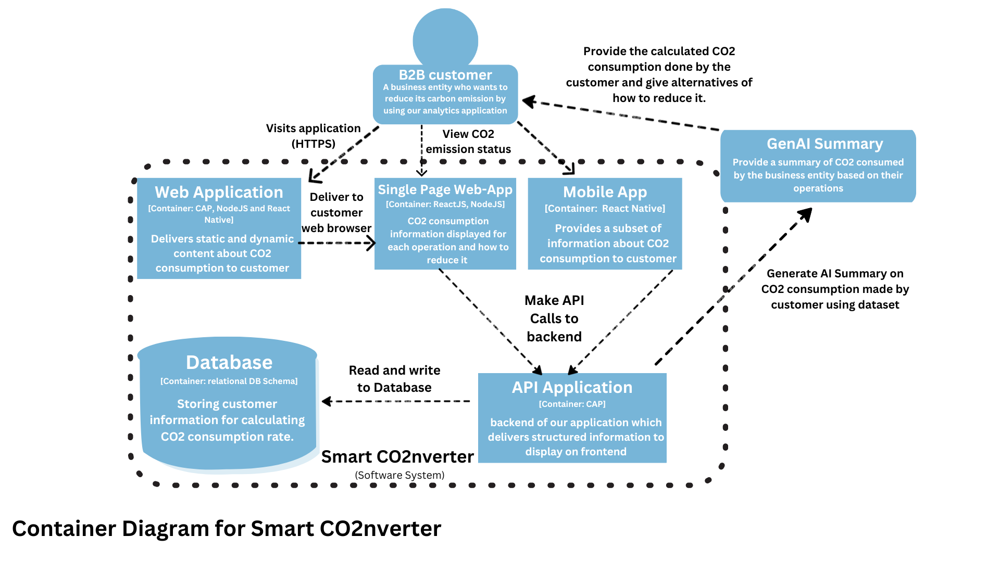
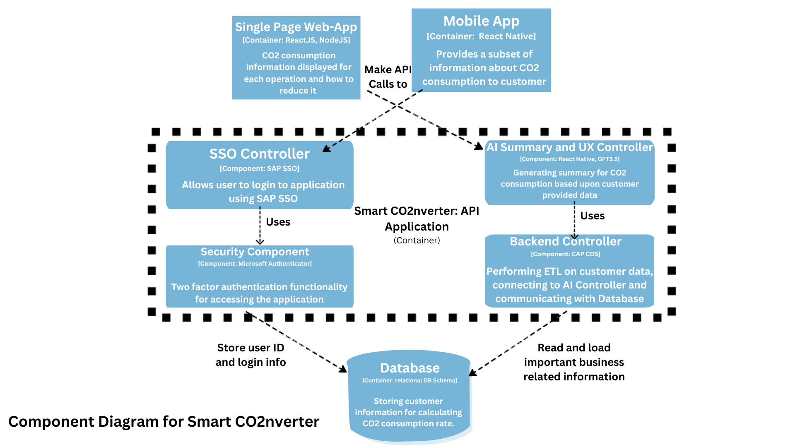
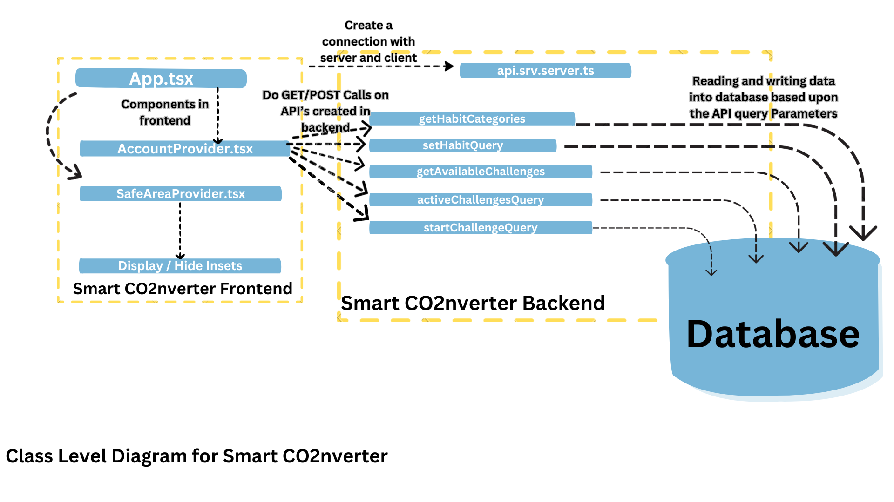

# SOLUTION ARCHITECTURE
Help users understand how their consumption habits are driving their CO2 footprint by showing most impactful expenses and best opportunities for emissions reductions.

 

# The C4 model for visualising software architecture
The C4 model is a set of visual notations and diagrams that help in visualizing the architecture of software systems. It provides a structured approach to representing different levels of abstraction, from high-level system context diagrams to low-level component diagrams.
The C4 model promotes simplicity and clarity in architectural diagrams. It emphasizes the use of a consistent set of symbols and conventions, making it easier for both technical and non-technical stakeholders to understand the software architecture.

## System Context Diagram (Level 1): 
This is the highest level of abstraction, representing the system as a whole and showing its external dependencies and interactions.

## Container Diagram (Level 2): 
This level zooms in on the system and shows the major containers or subsystems that make up the system. A container is a runtime instance, such as a web server, a database, or a desktop application.

## Component Diagram (Level 3): 
At this level, the focus is on the internal components of a container. A component is a grouping of related functionality within a container. Component diagrams show the key components and their relationships, allowing for a more detailed understanding of the internal structure.

## Code Diagram (Level 4): 
The lowest level of abstraction, this diagram provides a detailed view of the code within a component. It can show classes, interfaces, modules, or any other relevant code artifacts and their relationships. Code diagrams are particularly useful for understanding implementation details and dependencies.

